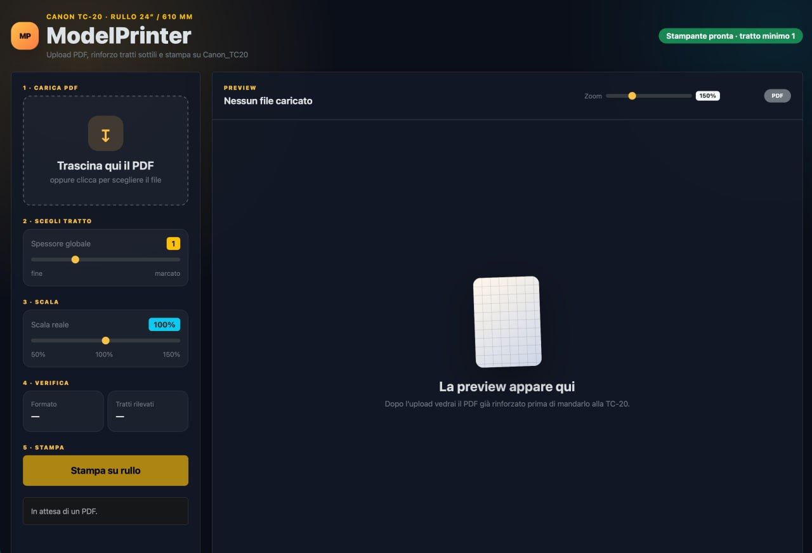

# ModelPrinter



## Italiano

ModelPrinter è una piccola webapp interna per preparare e stampare PDF/cartamodelli su una **Canon imagePROGRAF TC-20** a **rullo 24″ / 610 mm**.

Nasce per quei PDF da cartamodello o plotter in cui i tratti sono troppo fini: carichi il file, scegli lo spessore globale, controlli la preview e mandi in stampa via CUPS.

### Cosa fa

- Upload drag & drop di un PDF.
- Preview del PDF elaborato direttamente nel browser.
- Slider per **spessore globale del tratto**.
- Slider per **scala reale** del PDF, default `100%`.
- Rotazione automatica dei PDF landscape per visualizzarli/stamparli in verticale, più naturale su rullo.
- Zoom preview separato, utile per controllare lo spessore senza cambiare il file.
- Stampa in bianco e nero o a colori, con bianco e nero come default.
- Margine iniziale automatico da 10 mm per evitare tagli sul rullo.
- Invio in stampa tramite CUPS/IPP.
- Opzioni pensate per Canon TC-20: `MainRoll`, taglio automatico, formato custom basato sulla dimensione reale del PDF.

### Stack

- Python / Flask
- pikepdf
- Gunicorn
- nginx
- CUPS / IPP Everywhere
- Bootstrap locale vendorizzato, niente CDN obbligatoria

### Sviluppo locale

```bash
poetry install
MODELPRINTER_APP_ROOT=$PWD \
MODELPRINTER_JOB_ROOT=$PWD/data/jobs \
poetry run flask --app modelprinter.app:app run --debug
```

### Installazione

Vedi [INSTALL.md](INSTALL.md).

---

## English

ModelPrinter is a small internal web app for preparing and printing PDF sewing patterns / plotter drawings on a **Canon imagePROGRAF TC-20** with a **24″ / 610 mm roll**.

It is meant for PDFs where vector lines are too thin: upload the file, choose a global stroke width, inspect the preview, then print through CUPS.

### Features

- Drag & drop PDF upload.
- Browser preview of the processed PDF.
- **Global stroke width** slider.
- **Real PDF scale** slider, default `100%`.
- Automatic landscape-to-portrait rotation, better suited for roll printing.
- Separate preview zoom, useful to inspect line thickness without changing the file.
- Black-and-white or color printing, with black-and-white as default.
- Automatic 10 mm leading margin to avoid cuts on the roll.
- Printing through CUPS/IPP.
- Canon TC-20 oriented options: `MainRoll`, automatic cut, custom media size derived from the processed PDF.

### Stack

- Python / Flask
- pikepdf
- Gunicorn
- nginx
- CUPS / IPP Everywhere
- Vendored local Bootstrap, no required CDN

### Local development

```bash
poetry install
MODELPRINTER_APP_ROOT=$PWD \
MODELPRINTER_JOB_ROOT=$PWD/data/jobs \
poetry run flask --app modelprinter.app:app run --debug
```

### Installation

See [INSTALL.md](INSTALL.md).
